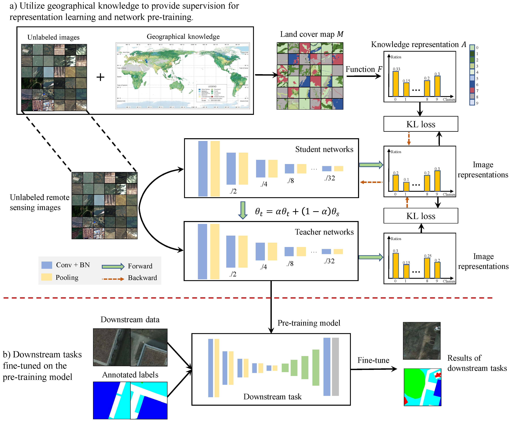

# Overview

__Geographical Knowledge-Driven Representation Learning for Remote Sensing Images. [Paper](<https://ieeexplore.ieee.org/abstract/document/9559903>)__

The proliferation of remote sensing satellites has resulted in a massive amount of remote sensing images. However, due to human and material resource constraints, the vast majority of remote sensing images remain unlabeled. As a result, it cannot be applied to currently available deep learning methods. To fully utilize the remaining unlabeled images, we propose a Geographical Knowledge-driven Representation (GeoKR) learning method for remote sensing images, improving network performance and reduce the demand for annotated data. The global land cover products and geographical location associated with each remote sensing image are regarded as geographical knowledge to provide supervision for representation learning and network pretraining. An efficient pretraining framework is proposed to eliminate the supervision noises caused by imaging times and resolutions difference between remote sensing images and geographical knowledge. A large-scale pretraining dataset Levir-KR is constructed to support network pretraining. It contains 1,431,950 remote sensing images from Gaofen series satellites with various resolutions. Experimental results demonstrate that our proposed method outperforms ImageNet pretraining and self-supervised representation learning methods and significantly reduces the burden of data annotation on downstream tasks, such as scene classification, semantic segmentation, object detection, and cloud/snow detection. It demonstrates that our proposed method can be used as a novel paradigm for pretraining neural networks. 



In this repository, we provide codes for cropping remote sensing images, generating supervised information, and pre-training. With the code, you can also try on your own dataset by following the instructions below.

# Requirements

- Python 3.5 or higher
- Pytorch 1.7
- CUDA 10.1
- CUDNN 7.5

See also in [Requirements.txt](requirements.txt).

# Setup

1. Clone this repo:

   ```
   git clone https://github.com/flyakon/Geographical-Knowledge-driven-Representaion-Learning.git
   cd Geographical-Knowledge-driven-Representaion-Learning
   ```

2. Prepare pre-training dataset, including cropping images and generating supervision via GlobeLand30.


3. Modify the configs file [GeoKR_resnet50_cfg.py](configs/GeoKR_resnet50_cfg.py) to configure the training parameters.

   ``````shell
python train.py --config_file configs/GeoKR_resnet50_cfg.py
   ``````
   

**We will give soon: 1) the meaning of parameters in configuration file; 2) the details description for preparing dataset; 3) pre-training model weights file**


# Citation

If you find the code useful, please cite:

``````
@article{li2021geographical,
  title={Geographical Knowledge-Driven Representation Learning for Remote Sensing Images},
  author={Li, Wenyuan and Chen, Keyan and Chen, Hao and Shi, Zhenwei},
  journal={IEEE Transactions on Geoscience and Remote Sensing},
  year={2021},
  publisher={IEEE}
}
``````

